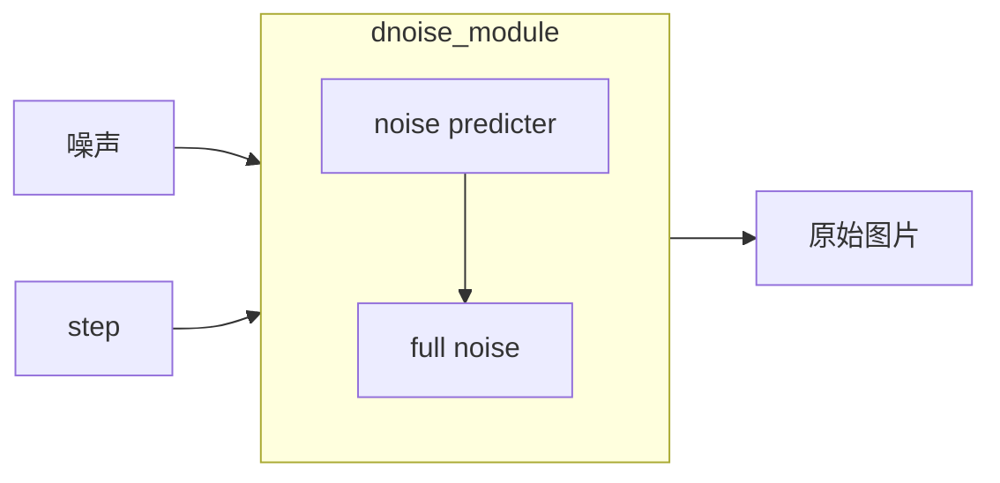

# 04-11

> 主要内容：[李宏毅Diffusion Model讲解](https://www.bilibili.com/video/BV14c411J7f2/?spm_id_from=333.337.search-card.all.click&vd_source=2e7a28848e74a5263086ab2562619823)
>
> 学习时长：2h（课程）2h（笔记）
>
> 其他时长：
>
> 相关资源与参考文献：
>
> 原视频：https://www.youtube.com/watch?v=ifCDXFdeaaM&t=210s 
>
> 课件链接：https://speech.ee.ntu.edu.tw/~hylee/ml/2023-spring.php

# diffusion model

> DDPM，还有其他变形，比如stable diffusion

运作原理： 

- 从完全噪声还原出图片（reverse process 反向过程）

- 前向过程（forward process / diffusion process）很简单，反向过程很难，所以用神经网络拟合

- todo：和resnet的区别

- 把文字考虑进去：依赖于训练集的规模（如laion.ai）所以midjourney这么强

